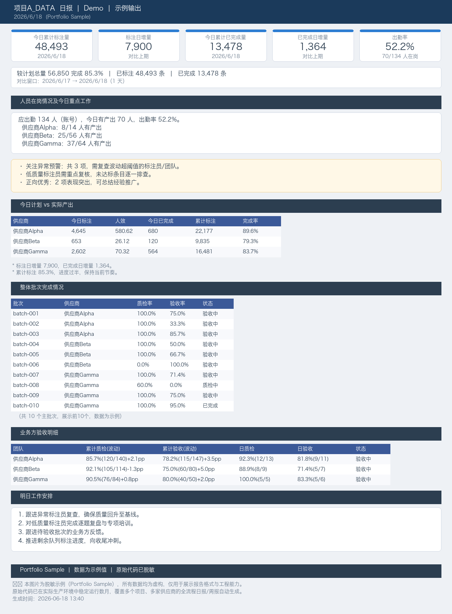
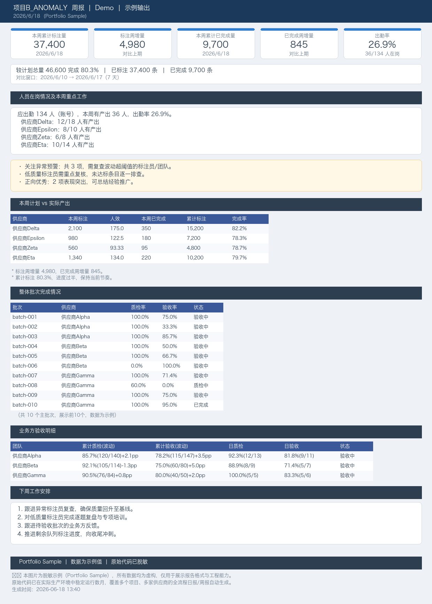

# PM Automation Toolkit


数据标注项目管理自动化工具集 — Python 日报/周报自动生成系统。

## 背景

本仓库是我在一家大型互联网公司游戏AI部门担任项目管理（PM）实习生期间，**独立开发并实际落地使用**的 Python 自动化工具集。原始代码已在生产环境中稳定运行数月，覆盖双项目、七供应商的全流程日报/周报自动生成。本版本对项目名称、供应商信息、人员数据进行了脱敏处理，保留全部工程逻辑。

## 解决的核心问题

AI 数据标注项目管理中存在大量重复性手工工作：
- 多供应商的日报/周报手工汇总，每天耗时 30+ 分钟且容易出错
- 标注员绩效波动难以快速定位
- 数据包分配与去重依赖人工核对
- PM 被困在琐碎的数据搬运中，无力聚焦流程决策

## 示例截图

### 日报 Sample



### 周报 Sample



## 项目结构

```
.
├── core_logic.py                  # 核心业务逻辑（波动分析+综合标记引擎，抽离自日报生成器，可单测）
├── 统一日报生成器.py              # 核心引擎：跨项目、跨供应商日报自动生成（3351行）
├── 统一周报生成器.py              # 周报生成器，复用日报模块按7天滑动窗口生成（81行）
├── 标注团队进度质量/
│   └── 标注团队进度质量日报.py      # 团队绩效日报（346行）
├── 生成示例报告图片.py              # 独立脚本：生成脱敏示例图片
├── tests/
│   └── test_core_logic.py          # 核心逻辑单测（18 项）
├── requirements.txt                # 运行依赖
├── 项目A_DATA_日报_Sample.png       # 日报示例截图
├── 项目B_ANOMALY_周报_Sample.png    # 周报示例截图
└── README.md
```

## 技术栈

| 技术 | 用途 |
|------|------|
| **Python 3** | 全部脚本语言 |
| **Pandas** | 数据读取（Excel/HTML）、清洗、合并、对比 |
| **XlsxWriter** | Excel 报表输出（含条件格式：红/金/绿标记） |
| **smtplib + email** | 邮件自动发送 |
| **openpyxl** | 验收进度 Excel 文件读写 |
| **Pillow** | 日报/周报图片生成 |
| **matplotlib** | 数据可视化图表 |

## 核心能力

### 1. 统一日报生成器

- **跨项目覆盖**：同时支持项目A_DATA、项目B_ANOMALY 两个项目
- **跨供应商覆盖**：自动汇总 7 家供应商数据
- **双维度分析**：
  - 团队绩效级（标注员维度）：产量、质检通过率、验收通过率的前后期对比
  - 项目大盘级（团队维度）：团队进度、批次质量汇总
- **双数据模式**：全量日报 + 当天日报，各取最新两份自动对比
- **波动分析引擎**：
  - 正负向波动自动标记（阈值可配置，默认 ±10%）
  - 综合标记系统：优秀/合格/不合格/异常
  - 异常智能归因：极低通过率（<60%）、高产量低质量自动识别
- **多格式输出**：
  - TXT 文本日报（含数据分析意见，非纯数字罗列）
  - Excel 报表（多Sheet + 条件格式：红=异常、金=优秀、绿=正常）
  - 邮件自动发送
- **离职人员自动过滤**：通过配置黑名单 + 日期过滤已离职标注员数据
- **命令行参数支持**：`--date` 指定日期、`--no-email` 跳过邮件、`--dry-run` 试运行

### 2. 统一周报生成器

- 调用日报模块，按 7 天滑动窗口生成周报
- 支持 TXT 文本 + PNG 图片双格式输出

### 3. 标注团队进度质量日报

- 专注于标注员绩效的前后期对比
- 支持新增成员/离职成员自动识别
- Excel 输出含条件格式，异常一目了然

## 测试

核心业务逻辑（波动分析 + 综合标记引擎）已抽离为 `core_logic.py` 并配有 18 项单测，CI 自动执行：

```bash
pip install -r requirements.txt     # 运行依赖
python -m unittest tests.test_core_logic   # 核心逻辑单测
python "统一日报生成器.py" --dry-run        # 冒烟：不落盘不发邮件
```

## 使用方式

```bash
# 日报：自动取最新数据对比
python3 统一日报生成器.py

# 日报：跳过邮件发送（脱敏版推荐）
python3 统一日报生成器.py --no-email

# 日报：手动指定日期
python3 统一日报生成器.py --date 2026-6-15

# 周报：自动取过去7天
python3 统一周报生成器.py

# 团队绩效日报
python3 标注团队进度质量/标注团队进度质量日报.py
```

## 脱敏说明

本版本已完成以下脱敏处理：

| 原始内容 | 替换为 |
|----------|--------|
| 项目代号名称 | 项目A_DATA、项目B_ANOMALY |
| 供应商企业名 | 供应商Alpha/Beta/Gamma/Delta/Epsilon/Zeta/Eta |
| 内部平台名称 | DataPlatform |
| 个人标注员ID | user_a001 ~ user_h008 |
| 内部邮箱/SMTP | 示例占位符 |
| 内部团队标识 | 已脱敏处理 |

**注意**：由于脱敏移除了实际数据文件与邮件服务配置，脚本无法直接运行——仅用于展示代码架构、工程思路与开发能力。

## 设计理念

这组工具的设计遵循"**用工程手段消灭重复劳动**"的理念：PM 不应把时间花在手工汇总数字上，而应聚焦于数据解读与流程决策。从最初一个几十行的小脚本开始，在数月使用中经历十余次版本迭代，逐步演进为覆盖双项目、七供应商的自动化日报系统。

## 关联项目

- **[ata-Annotation-Scripts](https://github.com/liuhao-hn/ata-Annotation-Scripts)** — Tampermonkey 浏览器端 JS 监控脚本集（16 个版本），覆盖标注员维度与任务看板维度的数据采集。本仓库的 Python 日报系统消费 JS 脚本导出的数据，实现"采集 → 汇总 → 分析 → 推送"全链路自动化。

---

*本仓库为个人能力展示用途，不包含任何企业机密数据或可运行环境。*
